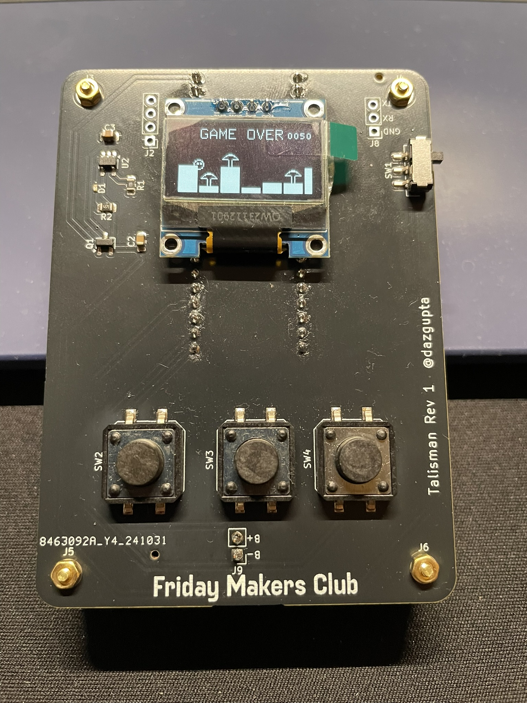

# Flappy Micologist

A flappy bird clone running on RP2040 where the player has to collect tiny mushrooms.



## Hardware

The code is primarily to run on my [custom hardware](https://github.com/arijitdasgupta/talisman), which is really just a RP2040 with some buttons and a screen. that I made.

## Development

```sh
rustup target install thumbv6m-none-eabi
cargo install flip-link
# Installs the probe-rs tools, including probe-rs run, our recommended default runner
cargo install --locked probe-rs-tools
# If you want to use elf2uf2-rs instead, do...
cargo install --locked elf2uf2-rs
```

For a debug build
```sh
cargo run
```
For a release build
```sh
cargo run --release
```

Some of the options for your `runner` are listed below:

* **`cargo embed`**
  This is basically a more configurable version of `probe-rs run`, our default runner.
  See [the `cargo-embed` tool docs page](https://probe.rs/docs/tools/cargo-embed/) for
  more information.
  
  *Step 1* - Install `cargo-embed`. This is part of the [`probe-rs`](https://crates.io/crates/probe-rs) tools:

  ```console
  $ cargo install --locked probe-rs-tools
  ```

  *Step 2* - Update settings in [Embed.toml](./Embed.toml)  
  - The defaults are to flash, reset, and start a defmt logging session
  You can find all the settings and their meanings [in the probe-rs repo](https://github.com/probe-rs/probe-rs/blob/c435072d0f101ade6fc3fde4a7899b8b5ef69195/probe-rs-tools/src/bin/probe-rs/cmd/cargo_embed/config/default.toml)

  *Step 3* - Use the command `cargo embed`, which will compile the code, flash the device
  and start running the configuration specified in Embed.toml

  ```console
  $ cargo embed --release
  ```

* **probe-rs-debugger**
  *Step 1* - Install Visual Studio Code from https://code.visualstudio.com/

  *Step 2* - Install `probe-rs`
  ```console
  $ cargo install --locked probe-rs-tools
  ```

  *Step 3* - Open this project in VSCode

  *Step 4* - Install `debugger for probe-rs` via the VSCode extensions menu (View > Extensions)

  *Step 5* - Launch a debug session by choosing `Run`>`Start Debugging` (or press F5)

* **Loading a UF2 over USB**  
  *Step 1* - Install [`elf2uf2-rs`](https://github.com/JoNil/elf2uf2-rs):

  ```console
  $ cargo install elf2uf2-rs --locked
  ```

  *Step 2* - Modify `.cargo/config` to change the default runner

  ```toml
  [target.`cfg(all(target-arch = "arm", target_os = "none"))`]
  runner = "elf2uf2-rs -d"
  ```

  The all-Arm wildcard `'cfg(all(target_arch = "arm", target_os = "none"))'` is used
  by default in the template files, but may also be replaced by
  `thumbv6m-none-eabi`.

  *Step 3* - Boot your RP2040 into "USB Bootloader mode", typically by rebooting
  whilst holding some kind of "Boot Select" button. On Linux, you will also need
  to 'mount' the device, like you would a USB Thumb Drive.

  *Step 4* - Use `cargo run`, which will compile the code and start the
  specified 'runner'. As the 'runner' is the `elf2uf2-rs` tool, it will build a UF2
  file and copy it to your RP2040.

  ```console
  $ cargo run --release
  ```

